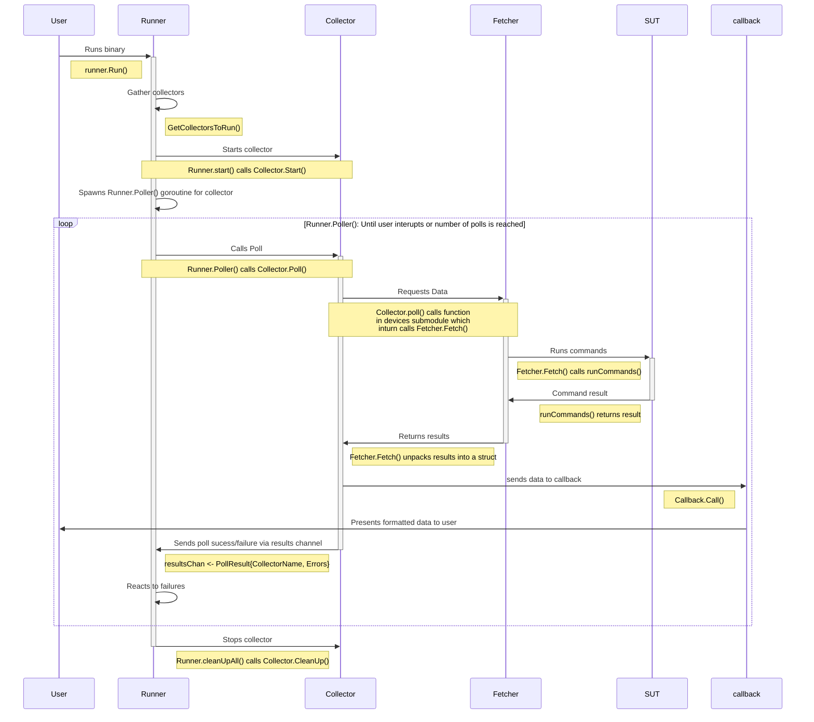

# Implementing Collectors

## High level flow
This sequance diagram shows the high level flow of data from the SUT to User and contains


## Step by step
You will first need to create a stuct for reporting the collected values to the user. It needs to conform to the `callbacks.OutputType` interface and any fields which you wish to show the user will require a json tag.

Any collector must conform to the collector interface It should use the callback to expose collected information to the user.

Once you have filled out your collector. Any arguments should be added to the `CollectionConstuctor` and function which takes the `CollectionConstuctor` should also be defined and added to the `registry`.

An example of a very simple collector:

In `collectors/collectors.go` any arguments additional should be added to the `CollectionConstuctor`
```go
...
type CollectionConstuctor struct {
	...
	Msg string
}
...
```

In `collectors/announcement_collector.go` you will first need to create your reporting stuct then
you should define your collector and a constructor function which takes `CollectionConstuctor` as an argument.
```go
package collectors

import (
	"fmt"

	"github.com/redhat-partner-solutions/vse-sync-collection-tools/collector-framework/pkg/callbacks"
)
const (
	AnnouncementCollectorName = "MyCustomerAnouncer"
	AnnouncementMsg = "custom-anouncement"
)

// Reporting message
type AnnouncementMessage struct {
	Msg string `json:"msg"`
}

func  (annMsg *AnnouncementMessage)  GetAnalyserFormat() (*callbacks.AnalyserFormatType, error) {
	formatted := callbacks.AnalyserFormatType{
		ID: "customAnoucner",
		Data: []string{
			annMsg.Msg,
		},
	}
	return &formatted, nil
}

// Collector
type AnnouncementCollector struct {
	*baseCollector
	msg          string
}

func (announcer *AnnouncementCollector) Poll(resultsChan chan PollResult, wg *utils.WaitGroupCount) {
	defer func() {
		wg.Done()
	}()

	msg := &AnnouncementMessage{Msg: announcer.msg}

	errs := make([]error, 0)
	err := announcer.callback.Call(&msg, AnnouncementMsg)
	if err != nil {
		errs = append(errs, fmt.Errorf("callback failed %w", err))
	}
	resultsChan <- PollResult{
		CollectorName: AnnouncementCollectorName,
		Errors:        errorsToReturn,
	}
}

func NewAnnouncementCollector(constuctor *CollectionConstuctor) (Collector, error) {
	announcer := AnnouncementCollector{
		baseCollector: newBaseCollector(
			constructor.PollInterval,
			false,
			constructor.Callback,
		),
		msg:constructor.Msg,
	}
	return &announcer, nil
}

func init(){
	// We'll make this a required collector
	RegisterCollector(AnnouncementCollectorName, NewAnnouncementCollector, required)
}
```
