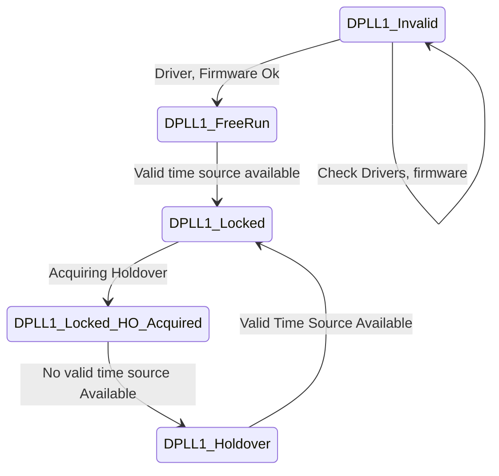

## Notes

```mermaid
stateDiagram-v2
    DPLL1_Invalid --> DPLL1_Invalid: Check Drivers, firmware
    DPLL1_Invalid --> DPLL1_FreeRun: Driver, Firmware Ok
    DPLL1_FreeRun --> DPLL1_Locked: Valid time source available
    DPLL1_Locked --> DPLL1_Locked_HO_Acquired: Acquiring  Holdover
    DPLL1_Locked_HO_Acquired --> DPLL1_Holdover: No valid time source Available
    DPLL1_Holdover --> DPLL1_Locked: Valid Time Source Available
```
