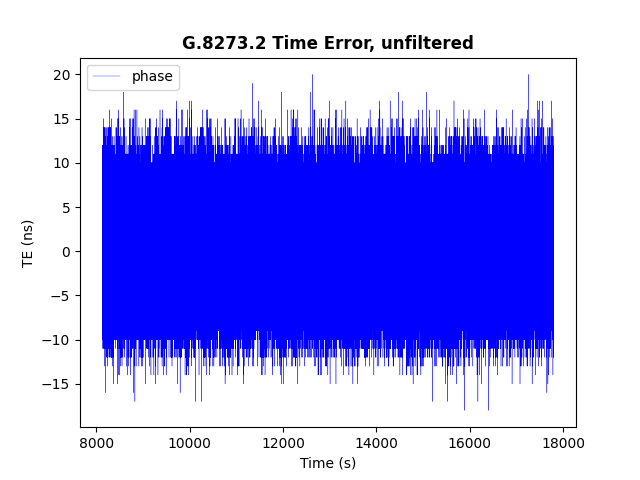
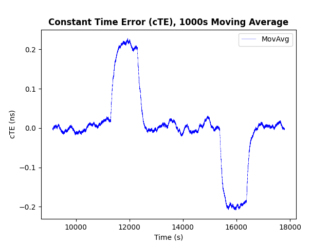
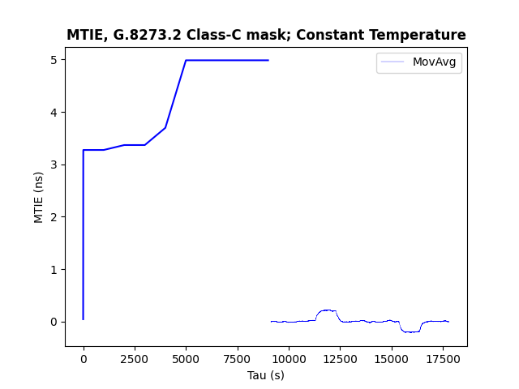
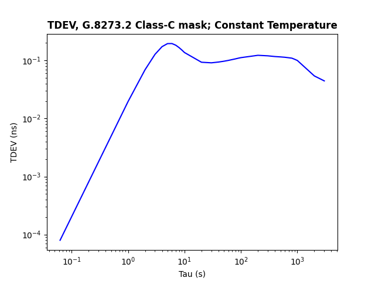

# QuickStart


## G.8272.2 Noise Generation KPIs


```console
# python3 ptp_ngen_kpis.py -h
usage: ptp_ngen_kpis.py [-h] -i INPUT [-c CLOCKCLASS] [-t TRANSIENT] [--plot PLOT] [-o OUTPUT]

optional arguments:
  -h, --help            show this help message and exit
  -c CLOCKCLASS, --clockclass CLOCKCLASS
                        clock class-[C,D] requirement to satisfy, defaults to
                        Class-C
  -t TRANSIENT, --transient TRANSIENT
                        transient period, defaults to 300sec
  -s STEADY, --steady STEADY
                        minimum steady state period to enable calculations,
                        defaults to 2000sec
  -p PLOT, --plot PLOT  add plots to the results
  -o OUTPUT, --output OUTPUT
                        Output file name, defaults to stdout

required arguments:
  -i INPUT, --input INPUT
                        Input sample data
```

## Build

1) Build the image to calculate Noise Generation KPIs according to G.8273.2:

```
# podman build -t quay.io/redhat-partner-solutions/ngen_kpis:0.1 -f ./ContainerFile
```

## Run

1) Pull the G.8273.2 Noise Generation KPIs container image:

```
# podman pull quay.io/redhat-partner-solutions/ngen_kpis:0.1
```

2) Data File derivated from ptp4l messages:

```
tstamp,phase,state,freq,delay
1184958.128,-98,2,-15910,22273
1184958.190,-91,2,-15908,22273
1184958.253,-67,2,-15876,22272
```

where:

tstamp: Timestamp
phase: Phase offset in ns
state: Servo clock state
freq: Frequency offset
delay: Path delay

3) Run the container to calculate G.8273.2 Noise Generation KPIs consuming post-processed data from ptp4l in `/tmp/data.csv`:

```
# podman run -it --rm -v /tmp:/tmp quay.io/redhat-partner-solutions/ngen_kpis:0.1 -i /tmp/data.csv
number of samples in Locked State : 159343
First Sample in Locked State is 3
First sample in state locked: 3
Update rate estimate from S2 deltas: 16 updates/s
Transient period below max allowed transient period 0.1875
G.8273.2 7.1 Max. Absolute Time Error, unfiltered measured; max|TE| <= 30 ns
Max |TE|: 20.000 ns

            pk-pk phase: 38.000 ns
            Mean phase: 0.003 ns
            Min phase: -18.000 ns
            Max phase: 20.000 ns
            Phase stddev: 4.617 ns

G.8273.2 7.1.1 Max. Constant Time Error averaged over 1000sec cTE <= 10 ns
Max |cTE|: 0.229 ns

            Mean cTE: 0.003 ns
            Min cTE: -0.209 ns
            Max cTE: 0.229 ns
            pk-pk cTE: 0.438 ns
            cTE stdev: 0.094 ns
            cTE Var: +/-0.229 ns

G.8273.2 7.1.2 Max. Dynamic Time Error, 0.1Hz Low-Pass Filtered; MTIE <= 10 ns
Max |MTIE|: 4.983 ns

            Min MTIE: 0.046 ns
            Max MTIE: 4.983 ns
            Max-Min MTIE: 4.937 ns

G.8273.2 7.1.2 Max. Dynamic Time Error, 0.1Hz Low-Pass Filtered; TDEV <= 2 ns
Max |TDEV|: 0.196 ns

            Min TDEV: 0.000 ns
            Max TDEV: 0.196 ns
            Max-Min TDEV: 0.196 ns
```

See some preliminary Noise Generation plots by using `-p True`:





